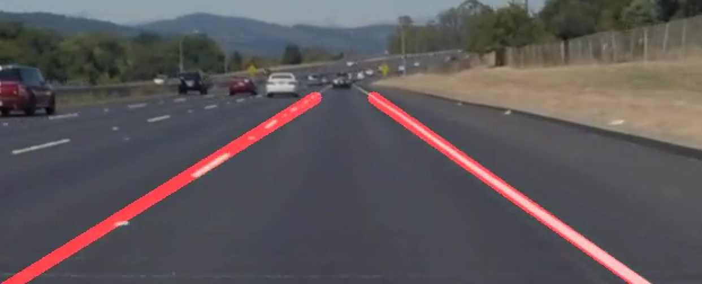

**Finding Lane Lines on the Road**

The goals / steps of this project are the following:
* Make a pipeline that finds lane lines on the road
* Reflect on your work in a written report

[//]: # 1 out put from the pipeline

[image1]: .image_output.jpg "Grayscale"

---

### Reflection

### 1. The pipeline and modification of the draw_lines() function.

My pipeline consisted of xxx steps.

Step 1: Converts the images to grayscale, then I use gaussian function to smooth the image.
Step 2: Defines the parameters of gaussian smoothing function.
Step 3: Defines the parameters for Canny edges detection function.
So far, I use the default value for parameters that I used in the quizzes through out the course.

Step 4: Defines 4 sides polygon to mark the region of interest

Step 5: Defines hough transformation parameters and run it on the image, then display the result

In order to draw a single line on the left and right lanes, I modified the draw_lines() function by the idea of:
* Dividing lines into left lines and right lines
* Give the same vertical value to the highest point of left and right lines. This is to make sure that both left and right line have similar lenghth.
* Use slope to determine the interceptions of the lines and the vertical axis (y-axis).
* Average the slope and the interceptions to calculate the horizontal value (x-axis) of the lower point and higher point of each left and right part.
* Finally draw the lines from those high and low points

If you'd like to include images to show how the pipeline works, here is how to include an image:

 
 

It looks pretty good, for now.

But when applying this pipeline to the video, the result is not as good as expected.
This is the result from the first video

But the result on video 02 is much better, however, we experienced some flickering and not as consistent.

### 2. Identify potential shortcomings with your current pipeline

My obvious shortcoming is that the line is not as stable as the example. And the other thing is that the quality of the pipeline is not consistent. It may appear good on single image, but works not so well with videos (which basically a serial of images, I don't know why)
One potential shortcoming would be what would happen when ...

Another shortcoming could be the ability to deal with other behavior such as changing lanes (which will cause super trouble since there may appear vertical lines) and going on curve lane (which is still cause error to the pipeline)

### 3. Suggest possible improvements to your pipeline

the first improvement that needed to be done asap is to stablize the pipeline. It should produce the stable line by design, but it still have some flickering now.

Another potential improvement could be to change the algorithm of the draw_lines function. I may use some kind of regression in order to make the function draw curve lines.
